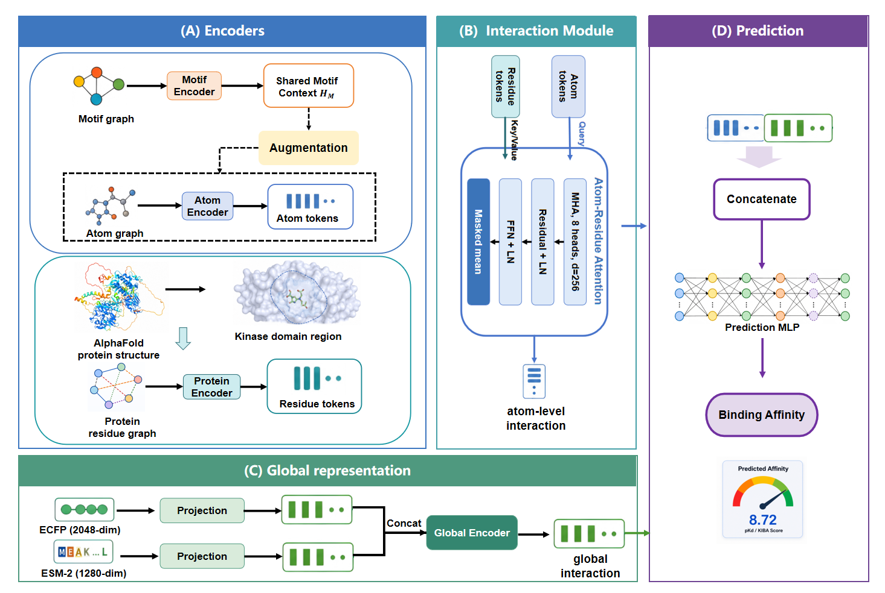

# HierDTA

HierDTA is a hierarchical drug-target affinity (DTA) model with **top-down
Motif-to-Atom semantic augmentation**. Functional-group and ring motifs enrich
atom representations between drug-GNN layers, and the final atom embeddings
cross-attend to protein-residue embeddings for affinity prediction.

## Model overview



The drug atom encoder and motif encoder use the same configurable backbone
type (`gat`, `gcn`, or `gin`) but have independent depths. The current
experimental configuration uses three atom-GNN layers and one motif-GNN layer.

## Motif-to-Atom semantic augmentation

The motif graph is encoded once and its representation is reused at each
augmentation position. For every atom, `MotifToAtomFusion` constructs:

- **Motif Context**: the mean representation of motifs containing the atom.
- **Atom Context**: the atom representation produced by the current GNN layer.
- **Atom Query**: the atom state entering that GNN layer.

`LocalAugmentation` treats Motif Context and Atom Context as a two-token
key/value sequence and uses Atom Query to decide how much information to draw
from them. Its output is added back through a residual connection. In the
current implementation, LocalAugmentation uses four attention heads.

With the current three-layer atom encoder, information flows as follows:

```text
H0 ── Atom GNN 1 ── LocalAugmentation 1 ── H1
H1 ── Atom GNN 2 ── LocalAugmentation 2 ── H2
H2 ── Atom GNN 3 ────────────────────────── H3
```

Augmentation is applied after every atom-GNN layer except the final layer.
Setting `--use_agg false` disables the motif encoder and all Motif-to-Atom
augmentation, providing the direct ablation baseline.

## Drug-protein interaction

After drug encoding, atom embeddings are the queries and protein-residue
embeddings are the keys and values of the drug-protein `CrossAttention`
module. Attention pooling produces a pair representation, which is fused with
global ECFP4 (2048-dimensional) and ESM (1280-dimensional) features before
regression.

The command-line argument `--num_heads` controls this drug-protein
CrossAttention only. It does **not** change the four heads inside
LocalAugmentation. Motif nodes do not directly attend to protein residues in
the current architecture.

## Requirements

The main dependencies are:

- PyTorch
- PyTorch Geometric and `torch-scatter`
- NumPy, pandas, SciPy, NetworkX, and tqdm
- RDKit
- `fair-esm`
- Matplotlib and Pillow for visualization

Install PyTorch, PyTorch Geometric, and `torch-scatter` using builds compatible
with the CUDA version on the target machine.

## Data preparation

Raw dataset files are expected below `data/<dataset>/`, where `<dataset>` is
`davis` or `kiba`.

```bash
python preprocessing/create_drug_data.py --dataset davis
python preprocessing/build_protein_graph.py --dataset davis
python preprocessing/cold_split.py --dataset davis --seeds 32 33 41 42 43
```

The split generator creates:

```text
data/davis/seed_41/
├── warm/{train,valid,test}.csv
├── unseen_drug/{train,valid,test}.csv
├── unseen_prot/{train,valid,test}.csv
└── unseen_pair/{train,valid,test}.csv
```

`unseen_pair` is the double-cold setting: neither the test drugs nor the test
proteins occur in training. Encoded drug and protein objects are cached under
`data/cache/` by default.

## Training

The following command matches the current principal GAT configuration:

```bash
python train.py \
  --dataset davis \
  --strategy warm \
  --seed 41 \
  --gpu_idx 0 \
  --drug_gnn_type gat \
  --drug_layer 3 \
  --motif_layer 1 \
  --protein_layer 3 \
  --hidden_dim 256 \
  --num_heads 8 \
  --dropout 0.2 \
  --use_agg true \
  --run_name motif2atom_mlayer1
```

Validation MSE is used for checkpoint selection. Test output includes RMSE,
MSE, Pearson correlation, concordance index (CI), and Rm2. Unless
`--result_root` is specified, artifacts are written to:

```text
results_<dataset>/<strategy>/seed_<seed>/
├── ckpt_<run_name>_best.pt
└── result_<run_name>.csv
```

## Citation

If you use this repository, please cite the associated paper. Citation details
will be added after publication.

## Acknowledgements

Protein graph construction is adapted from
[3d-prot-dta](https://github.com/vtarasv/3d-prot-dta), and functional-group
decomposition is adapted from [HimGNN](https://github.com/UnHans/HimGNN).
